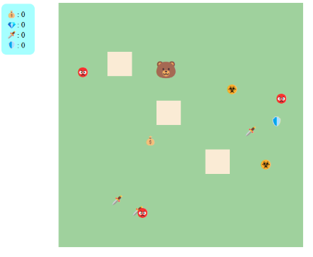

# Simple RPG Game (Vue 3)

A simple RPG game developed with **Vue 3** on the frontend and **.NET**
on the backend (currently in progress). The goal of this project is to explore
Vue 3 while developing a game system, with plans to integrate backend functionality
for storing and loading game state.

---

## 🧠 Purpose

To practice frontend development with **Vue 3** while building a basic RPG game.
The project will feature player interactions, challenges, and state persistence.

---

## ⚙️ Technologies

- **Vue 3** — frontend development, utilizing the Composition API for managing game states and components.
- **.NET** (coming soon) — backend for saving/loading game state and managing interactions.
- **PostgreSQL** (future implementation) — potential database integration for storing player stats and game progress.

---

## 🚀 How to Run

### Frontend (Vue 3)

1. Navigate to the **clientapp** directory:
   ```bash
   cd clientapp
   ```

2. Install dependencies:

    ```bash
    npm install
    ```

3. Run the frontend locally:

    ```bash
    npm run dev
    ```

4. Backend (.NET)

    Ensure you have .NET SDK installed.

    Run the backend using Visual Studio or via command line:

    ```bash
    dotnet run
    ```

Note: Backend for now is an empty template.

---

## 🧩 Current Features

Vue 3 frontend displaying game mechanics.

Basic structure set for player interactions, challenges, and future state saving.

---

## ⏳ Next Steps

Player refactor: Move player logic to a separate class for better organization.

Player attributes: Introduce attributes such as "fatigue" to the player and "difficulty" to challenges.

Challenge interactions: Allow players to either run away or attempt to solve challenges when encountering them.

Game state persistence: Integrate the backend for saving and loading the game state.

UI/UX improvements: Enhance game interface for a more interactive experience.

---

## 📸 Screenshot



---

The project is developed in free time during weekends, and backend development will be added gradually.
